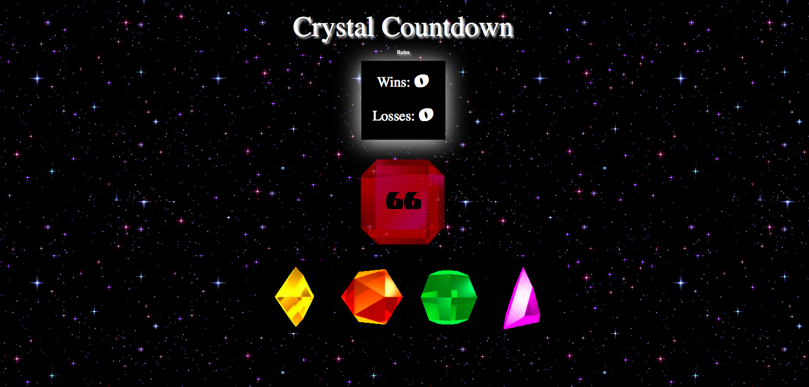

# Crystal-Game

<!-- Put a description of what the project is -->
Learning jQuery: Click event handlers, dymanically creating html elements and assigning attributes to them

## Link to deployed site
<!-- make a link to the deployed site --> 
<!-- [What the user will see](the link to the deployed site) -->
[crystal-game](https://ajitas.github.io/Crystal-Game/)

## Images
<!-- take a picture of the image and add it into the readme  -->
<!--  -->


## technology used
<!-- make a list of technology used -->
<!-- what you used for this web app, like html css -->

<!-- 
1. First ordered list item
2. Another item
⋅⋅* Unordered sub-list. 
1. Actual numbers don't matter, just that it's a number
⋅⋅1. Ordered sub-list
4. And another item. 
-->
1. HTML
2. CSS
3. Javascript
    * control structure
    * data structures
    * functions
4. jQuery
    * Event Handling
    * Dynamically creating new html elements
    * Providing text to dynamically created html elements
    * Providing attributes to dynamically created html elements
    * Displaying/Hiding elements with show()/hide()


## code snippets
<!-- put snippets of code inside ``` ``` so it will look like code -->
<!-- if you want to put blockquotes use a > -->

```
//checks if the target sum is greater than 0
function isScorePositive(intArg){
    if(intArg>0)
        return true;
    else
        return false;
}

//resets the game
function resetGame(){
    //generate 4 random numbers between 1-12
    randNum1 = Math.floor(Math.random()*12)+1;
    randNum2 = Math.floor(Math.random()*12)+1;
    randNum3 = Math.floor(Math.random()*12)+1;
    randNum4 = Math.floor(Math.random()*12)+1;
    //generate a random number for target sum between 19-120
    randTotal = Math.floor(Math.random()*102)+19;
    //show the target sum in the appropriate position
    $("#target-score").text(randTotal);
}

//checks if the game is over or one can continue to play
function checkforGameOver(){
    //check if target sum is less than 1
    if(!isScorePositive(randTotal)){
        //if target sum is exactly 0, you won the game
        if(randTotal ==0){
            //increase wins and display it with a sound
            win++;
            document.getElementById("winner-sound").play();
            $("#wins").text(parseInt($("#wins").text()) +1);
        }
        else{
            //increase losses and display it with a sound
            loss++;
            document.getElementById("loser-sound").play();
            $("#losses").text(parseInt($("#losses").text()) +1);
        }
        //restart the game
        resetGame();
    }
}

$( document ).ready(function() {
    //resets the game and scoreboard
    resetGame();
    $("#wins").text("0");
    $("#losses").text("0");

}).on("click","#crystal1",function(){
    //subtract the random number clicked from the target sum shown
    randTotal = randTotal - randNum1;
    //update the target score
    $("#target-score").text(randTotal);
    //check if the game is over or not
    checkforGameOver();
    
});
```
## Learning points
* Event Handling in jQuery
* Dynamically creating new html elements using jQuery
* Providing text or html to the dynamically created html elements
* Providing attributes to dynamically created html elements using jQuery
* Displaying/Hiding elements with show()/hide() jQuery


## Author 
[Ajita Srivastava](https://github.com/ajitas)

## License
Standard MIT License